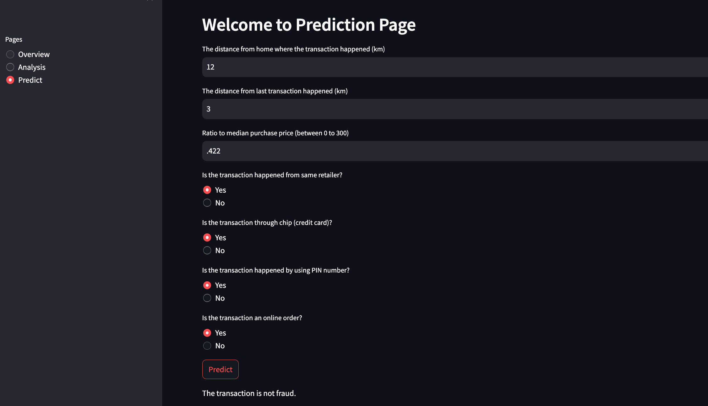

# Fraud Transaction Detection Project

## Objectives
This project focuses on building an accurate fraud detection system for businesses, utilizing real-time data ingestion, robust validation, and diverse model training. Results are systematically tracked, supporting informed decisions. The user-friendly deployment and automation enhance operational efficiency, promoting a secure and adaptable financial environment, while open-source collaboration ensures continuous improvement.

## Overview
This project focuses on fraud transaction detection using a comprehensive end-to-end pipeline, from data ingestion to prediction deployment. The entire workflow is designed for simplicity and efficiency, enabling users to retrain the model with a single command/API.



## Key Components
#### 1. Data Ingestion
* Data is sourced online and downloaded automatically. The ingestion process is a crucial step that ensures the most recent data is used for training and prediction. After downloading, the data is extracted to uncover relevant information for fraud detection. This step is essential for understanding the dataset's structure and features.

#### 2. Data Validation
* Ensuring data quality is maintained through validation is critical. This phase involves checking the validity of all columns to filter out any inconsistencies or errors in the dataset.

#### 3. Data Transformation
* A robust preprocessing pipeline is implemented to transform raw data into a suitable format for machine learning models. Feature engineering and scaling are performed in this phase. The dataset is split into training and testing sets to facilitate model evaluation. This ensures the model's performance is accurately assessed on unseen data.

#### 4. Model Training
* Machine learning models are trained using the prepared dataset. The choice of models depends on the specific requirements and characteristics of the fraud detection problem.

#### 5. Model Evaluation
* Various metrics are employed to evaluate the model's performance. The results of the model evaluation are saved for future reference. This step is crucial for tracking the performance of different models over time.

#### 6. Prediction Pipeline and Deployment
* A streamlined prediction pipeline is implemented, allowing users to make predictions using the trained model effortlessly. The model is deployed using Streamlit, providing an interactive platform for users to input data and receive predictions. Streamlit Multipage is utilized to showcase detailed analysis and insights derived from the data.

## Retraining
Retraining the model is simplified to a single command. This feature enhances the model's adaptability to evolving patterns in fraudulent transactions.
```bash
python main.py
```

## How to Use?

First clone the project to download in your local directory:
```bash
git clone https://github.com/mddmustainbillah/fraud-transaction-detection.git
```
Create a virtual environment:
```bash
conda create -n mlvenv python=3.9 -y 
```

Activate the environment:
```bash
conda activate mlvenv
```

Install all the necessary requirements:
```bash
pip install -r requirements.txt
```

```bash
streamlit run app.py
```
Then, go to the streamlit generated link.

## Contributions
Contributions and feedback are welcome. Feel free to open issues or submit pull requests to enhance the project's functionality and reliability.